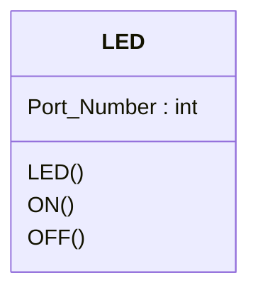

# การสร้าง ESP32 LED Component

ESP-IDF รองรับการเขียนโปรแกรมในภาษา C++ ช่วยให้สามารถสร้าง component ในลักษณะ object ได้ ซึ่งจะทำให้การเขียนโปรแกรมทำได้อย่างเป็นธรรมชาติมากขึ้น

พิจารณา class LED เบื้องต้นที่มีองค์ประกอบอย่างง่าย 

|element| Description|
|-------|------------|
|  Port_Number : int | กำหนดหมายเลขพอร์ตที่เชื่อมต่อกับ  LED|
|  LED() | Constructor ทำหน้าที่กำหนดค่าต่าง ๆ ในตอนสร้าง object เช่น การกำหนดทิศทางของพอร์ต|
|  ON() | สั่งให้ LED ติด |
|  OFF() | สั่งให้ LED ดับ |

