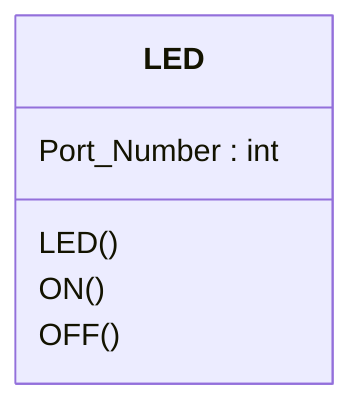

# การสร้าง ESP32 LED Component

ESP-IDF รองรับการเขียนโปรแกรมในภาษา C++ ช่วยให้สามารถสร้าง component ในลักษณะ object ได้ ซึ่งจะทำให้การเขียนโปรแกรมทำได้อย่างเป็นธรรมชาติมากขึ้น

พิจารณา class ต่อไปนี้ 

Class LED

